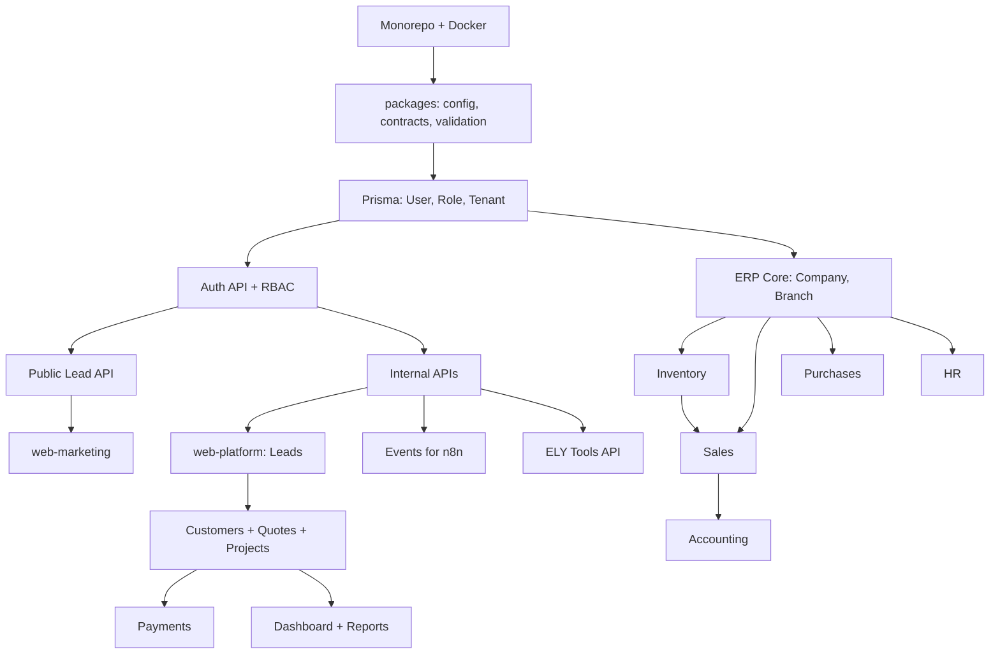

# خطة التنفيذ التفصيلية — Matrix / AllInAll ERP

> **تاريخ الإعداد:** 2025-06-25  
> **المصادر:** وثيقة المتطلبات البرمجية · AGENTS.md · ELY · n8n Automation  
> **مبدأ التنفيذ:** تغييرات صغيرة، آمنة، قابلة للمراجعة — **لا مهمة كبيرة دفعة واحدة**

---

## 1. ملخص تنفيذي

**Matrix** منصة SaaS/On-premise لإدارة دورة العميل الكاملة: من طلب الخدمة عبر الموقع → مراجعة داخلية → عرض سعر → مشروع تنفيذ → تشغيل **AllInAll ERP** متعدد الشركات والفروع.

| الطبقة | التطبيق | الوصف |
|--------|---------|-------|
| الموقع العام | `apps/web-marketing` | صفحات تعريفية + نماذج طلبات (بدون أسعار علنية) |
| لوحة التحكم | `apps/web-platform` | Matrix Control Center — Leads, Customers, Quotes, Projects… |
| واجهة ERP | `apps/web-erp` | واجهة العميل لـ ERP (Tenant) |
| Backend | `apps/api` | REST API + Auth + RBAC + Tenant isolation |
| خلفية | `apps/worker` | Queues، إشعارات، مهام مجدولة |
| مشترك | `packages/*` | ui, i18n, contracts, validation, config |

**ELY** (الذكاء الاصطناعي) و **n8n** (الأتمتة) **لا يُبنيان قبل استقرار المنصة الأساسية والـ API.**

---

## 2. قواعد ذهبية (من AGENTS.md — إلزامية)

```
Analyze → Plan → Change small part → Run checks → Fix errors → Document
```

| القاعدة | التطبيق العملي |
|---------|----------------|
| مهمة واحدة = 1–5 ملفات | لا PR ضخم، لا "ابنِ ERP كامل" |
| ترتيب الموديول | Types → Zod → Prisma → Service → API → UI → Permissions → Audit → Build |
| بعد كل تعديل | `pnpm --filter <app> build` للتطبيق المتأثر |
| الأخطاء | سجّل في `docs/progress/error-analysis.md` |
| الأمان | Tenant isolation · RBAC · soft delete · لا PII في logs |
| ممنوع | `git add .` · إعادة كتابة المشروع · كتم أخطاء build |

---

## 3. هيكل Monorepo المستهدف

```
matrix/
├── apps/
│   ├── web-marketing/     # Next.js — الموقع العام
│   ├── web-platform/      # Next.js — Matrix Control Center
│   ├── web-erp/           # Next.js — ERP UI للعميل
│   ├── api/               # NestJS (أو Next API مؤقتًا) + Prisma
│   └── worker/            # BullMQ / background jobs
├── packages/
│   ├── ui/                # مكونات مشتركة (Button, Table, Form…)
│   ├── i18n/              # ar/en + RTL/LTR
│   ├── contracts/         # أنواع TypeScript مشتركة
│   ├── validation/        # Zod schemas
│   └── config/            # eslint, tsconfig, tailwind
├── prisma/
│   └── schema.prisma      # أو داخل apps/api
├── docs/
│   ├── IMPLEMENTATION-PLAN.md
│   ├── progress/
│   │   ├── error-analysis.md
│   │   ├── sprint-log.md
│   │   └── module-checklist.md
│   └── extracted/         # نصوص الوثائق المستخرجة
├── docker-compose.yml     # PostgreSQL + Redis (محلي)
├── pnpm-workspace.yaml
└── package.json
```

**Stack مقرر:**
- Frontend: Next.js App Router · React · TypeScript · Tailwind
- Backend: NestJS + Prisma + PostgreSQL + Redis
- Auth: JWT sessions · bcrypt/argon2
- i18n: عربي/إنجليزي · RTL/LTR · Dark/Light

---

## 4. التقسيم الكبير (كما طلبت)

```
┌─────────────────────────────────────────────────────────────┐
│  المرحلة A: الأساس + APIs                                   │
├─────────────────────────────────────────────────────────────┤
│  المرحلة B: الموقع العام (web-marketing)                    │
├─────────────────────────────────────────────────────────────┤
│  المرحلة C: Matrix Control Center (web-platform)            │
├─────────────────────────────────────────────────────────────┤
│  المرحلة D: ERP — موديول موديول (web-erp + API)            │
├─────────────────────────────────────────────────────────────┤
│  المرحلة E: الداشبورد والتقارير                            │
├─────────────────────────────────────────────────────────────┤
│  المرحلة F: ELY (بعد استقرار API)                           │
├─────────────────────────────────────────────────────────────┤
│  المرحلة G: n8n Automation (بعد Events API)                 │
└─────────────────────────────────────────────────────────────┘
```

---

## 5. خريطة التبعيات (Dependencies)



**قاعدة:** لا تبدأ ERP قبل اكتمال: Auth + Leads + Customers + Quotes (MVP الداخلي).

---

## 6. المرحلة A — الأساس والـ APIs (الأسبوع 1–2)

### A.1 — يوم 1: Scaffold فقط (بدون منطق أعمال)

| # | المهمة | الملفات المتوقعة | فحص |
|---|--------|------------------|-----|
| A1.1 | `pnpm-workspace` + turbo/pnpm scripts | 5–8 ملفات جذر | `pnpm install` |
| A1.2 | `packages/config` — tsconfig, eslint مشترك | 3–4 | lint |
| A1.3 | `packages/contracts` — أنواع فارغة + exports | 2–3 | build |
| A1.4 | `packages/validation` — هيكل Zod | 2–3 | build |
| A1.5 | `docker-compose` — Postgres + Redis | 1 | `docker compose up -d` |
| A1.6 | `apps/api` — NestJS skeleton + health | 5–10 | `pnpm --filter @allinall/api build` |

**مخرجات اليوم 1:** Monorepo يعمل · DB متصلة · `/health` يرد 200 · لا UI بعد.

### A.2 — يوم 2–3: Auth + Users + Roles

| الكيان | الحقول الأساسية |
|--------|-----------------|
| User | id, email, passwordHash, name, status, tenantId?, createdAt, updatedAt, deletedAt |
| Role | id, name, slug, permissions[] |
| UserRole | userId, roleId |
| LoginAudit | userId, ip, userAgent, success, createdAt |

**Endpoints:**
- `POST /auth/login` · `POST /auth/logout` · `GET /auth/me`
- `GET/POST /internal/users` · `GET/PATCH /internal/users/:id`
- `GET /internal/roles`

**مهام micro (كل واحدة منفصلة):**
1. Prisma schema للمستخدمين
2. migration + seed (dev فقط)
3. Auth service (hash, JWT)
4. Auth guard + RBAC decorator
5. Login endpoint + rate limit
6. LoginAudit تسجيل

### A.3 — يوم 4–5: Tenant + Audit Log

| الكيان | الغرض |
|--------|-------|
| Tenant | عزل بيانات العميل في ERP |
| AuditLog | entityType, entityId, action, oldValue, newValue, userId, ip |

**Middleware إلزامي:** `tenantId` من JWT — رفض أي طلب يتجاوز Tenant.

### A.4 — Public API (Lead Intake)

```
POST /public/leads
POST /public/contact
POST /public/quote-request
```

**حماية النموذج:**
- Honeypot · formStartedAt · rate limit (IP + phone)
- Lead Number: `AIA-YYYY-XXXXXX`
- لا تسجيل PII في logs

---

## 7. المرحلة B — الموقع العام `web-marketing`

### الصفحات (13 صفحة)

| # | الصفحة | Route | أولوية |
|---|--------|-------|--------|
| 1 | الرئيسية | `/` | P0 |
| 2 | من نحن | `/about` | P1 |
| 3 | الخدمات | `/services` | P0 |
| 4 | ERP | `/services/erp` | P1 |
| 5 | أنظمة مخصصة | `/services/custom` | P2 |
| 6 | مواقع وتطبيقات | `/services/web-mobile` | P2 |
| 7 | الباقات | `/packages` | P1 |
| 8 | احسب احتياجك | `/calculator` | P2 |
| 9 | اطلب نظامك | `/request` | **P0** |
| 10 | تواصل | `/contact` | P0 |
| 11 | FAQ | `/faq` | P2 |
| 12 | الخصوصية | `/privacy` | P1 |
| 13 | الشروط | `/terms` | P1 |

### مكونات مشتركة (بناء تدريجي)

1. `Layout` + Header (لغة، ثيم، CTA)
2. `packages/i18n` — ar/en
3. `RequestForm` — types طلبات الـ 7 أنواع
4. ربط `POST /public/leads`
5. صفحة نجاح مع رقم الطلب

**قواعد UX:**
- لا أسعار نهائية علنية
- CTA: اطلب نظامك · واتساب · تواصل
- RTL مضبوط من البداية

### ترتيب بناء الموقع

```
i18n + Layout → الصفحة الرئيسية → نموذج الطلب → Contact → باقي الصفحات
```

---

## 8. المرحلة C — Matrix Control Center `web-platform`

### الصفحات الأساسية (17)

Login · Dashboard · Leads · Lead Details · Customers · Customer Details · Quotes · Quote Builder · Projects · Project Details · Payments · Users · Roles & Permissions · Login Audit · Settings · Services Catalog · System Logs

### ترتيب الموديولات الداخلية

| الترتيب | الموديول | API | UI | ملاحظات |
|---------|----------|-----|-----|---------|
| C1 | Login + Shell | auth | layout + sidebar | — |
| C2 | Dashboard | aggregates | widgets | يعتمد على Leads |
| C3 | **Leads** | CRUD + status + notes | list + details | **أول موديول أعمال** |
| C4 | **Customers** | CRUD + convert | list + details | من Lead won |
| C5 | **Quotes** | builder + items | quote builder | draft → sent → accepted |
| C6 | **Projects** | milestones + tasks | kanban/list | بعد قبول العرض |
| C7 | **Payments** | manual status | list | بدون checkout |
| C8 | Users & Roles | RBAC UI | admin | — |
| C9 | Settings + Catalog | — | forms | — |
| C10 | Audit + Logs | read-only | tables | — |

### Lead — حالات وأفعال

**حالات:** `new` → `contacted` → `needs_review` → `qualified` → `proposal_sent` → `won` | `lost` | `archived`

**أفعال:** Assign · Add note · Change status · Create quote · Convert to customer · Archive

### سير العمل الكامل (من الوثيقة)

```
زائر → نموذج طلب → Lead → Sales يراجع → Quote → إرسال → قبول
→ Customer → Project → Tenant ERP → تدريب → تسليم → اشتراك
```

---

## 9. المرحلة D — ERP (موديول موديول)

### D.0 — ERP Core (قبل أي موديول)

| الكيان | الغرض |
|--------|-------|
| Tenant | عزل العميل |
| Company | شركة داخل Tenant |
| Branch | فرع |
| Department | قسم |
| FiscalYear | سنة مالية |
| Currency | عملة |

**قاعدة:** كل query في ERP يُفلتر بـ `tenantId` + `companyId` + `branchId` حسب الصلاحية.

### ترتيب موديولات ERP

| # | الموديول | الجداول الرئيسية | يعتمد على |
|---|----------|------------------|-----------|
| D1 | **Inventory** | products, warehouses, stock_movements, stock_levels | ERP Core |
| D2 | **Sales** | erp_customers, sales_quotes, sales_orders, sales_invoices | Inventory |
| D3 | **Purchases** | suppliers, purchase_orders, supplier_invoices | Inventory |
| D4 | **Accounting** | accounts, journal_entries, fiscal_years | Sales + Purchases |
| D5 | **HR** | employees, attendance, leave_requests | ERP Core |
| D6 | **Debts** | receivables, payables, payment_schedules | Sales + Purchases |
| D7 | **Subscriptions** | plans, entitlements, subscriptions | Customers |

### كل موديول ERP — checklist (من الوثيقة)

- [ ] Database schema + migration
- [ ] Zod validation
- [ ] Service layer
- [ ] API endpoints (`/erp/...`)
- [ ] Permissions (Role-based)
- [ ] Audit log للعمليات الحساسة
- [ ] UI pages (list, create, edit, view)
- [ ] Loading / Empty / Error states
- [ ] ar/en labels
- [ ] Build ناجح

### قواعد أعمال حرجة

| الموديول | القاعدة |
|----------|---------|
| Accounting | لا حذف قيود معتمدة — عكس فقط |
| Inventory | لا بيع بدون مخزون (إلا بصلاحية) |
| HR | الرواتب لصلاحيات محددة |
| الكل | soft delete فقط |

---

## 10. المرحلة E — الداشبورد والتقارير

### Matrix Dashboard (داخلي)

- طلبات جديدة · قيد المراجعة · عروض مرسلة/مقبولة
- عملاء نشطون · مشاريع مفتوحة · مدفوعات منتظرة
- آخر الأنشطة

### تقارير Matrix

Leads by status · Sales conversion · Quotes sent/accepted · Revenue expected · Projects status · Payment pending · User activity

### تقارير ERP

Inventory stock · Sales · Purchases · Customer/Supplier balances · Trial balance · P&L · HR attendance · Branch performance

**متطلبات:** فلترة (تاريخ، فرع، شركة) · صلاحيات التقرير · Export CSV/PDF (مرحلة لاحقة)

---

## 11. المرحلة F — ELY (لا تبدأ قبل المرحلة C مكتملة)

### نهج ELY

`RAG + Knowledge Base + Tools + Workflow Actions` — **ليس** تدريب نموذج من الصفر.

### مراحل ELY

| Phase | المحتوى |
|-------|---------|
| ELY-1 | Knowledge Catalog + Upload + Approval + Basic Chat |
| ELY-2 | مساعد Leads/Quotes/Projects + Tool calling محدود |
| ELY-3 | ERP assistant (مخزون، مبيعات، حسابات) |
| ELY-4 | Evaluation + Training examples + n8n integration |
| ELY-5 | Predictive analytics (مستقبلي) |

### قواعد ELY

- نفس صلاحيات النظام — لا يتجاوز RBAC
- لا يكتب في DB مباشرة — فقط عبر Matrix API
- Actions حساسة تحتاج Approval
- كل tool call مسجّل في audit

### جداول ELY (مرحلة لاحقة)

`ely_knowledge_items` · `ely_documents` · `ely_embeddings` · `ely_conversations` · `ely_tool_calls` · `ely_feedback`

---

## 12. المرحلة G — n8n Automation (بعد Events API)

> **الوثائق:** [`docs/specs/n8n-automation.md`](specs/n8n-automation.md) · [`docs/specs/N8N-EXECUTION-PLAN.md`](specs/N8N-EXECUTION-PLAN.md)

### المبدأ المعماري

```text
Event in Matrix → API emits webhook (signed) → n8n workflow
→ external channels (Email/WhatsApp) OR Matrix API callback
→ automation_logs + audit
```

**n8n ليس مصدر الحقيقة — كل تعديل عبر Matrix API فقط.**

### Event Naming: `domain.entity.action`

```text
platform.lead.created · platform.quote.sent · erp.inventory.low_stock
ely.knowledge.pending_review · support.ticket.created
```

### البنية المطلوبة في Matrix (قبل n8n)

| المكوّن | الوصف |
|---------|--------|
| `automation_logs` | eventId, workflowName, status, payloads, retryCount |
| `EventEmitterService` | emit + HMAC + webhook to n8n |
| Headers | `X-Matrix-Event`, `X-Matrix-Event-Id`, `X-Matrix-Signature`, `X-Matrix-Timestamp` |
| Automation API | `POST/GET /automation/events`, `POST/GET /automation/logs` |

### 35 Workflow — ملخص بالمراحل

| المرحلة | العدد | أمثلة |
|---------|-------|-------|
| **n8n-1** (بعد MVP-1) | 7 | Lead notification · Quote sent · Payment reminder · Health check |
| **n8n-2** | 10 | Quote accepted · Customer onboarding · Owner report · Low stock |
| **n8n-3** | 15 | HR · Accounting · ELY · Backups |
| **n8n-4** | 3+ | WhatsApp · Multi-tenant settings · Google Sheets |

### قالب كل Workflow

Idempotency check → Validate signature → Logic → Log success/fail → Retry on error

### Fallback عند الفشل

```text
WhatsApp فشل → Email → task داخلي → تسجيل failure
```

### API إضافية لـ n8n (بعد Internal API)

```text
GET  /internal/leads?status=new&olderThan=2h
GET  /internal/projects/overdue
GET  /erp/inventory/low-stock
GET  /erp/sales/daily-summary
GET  /erp/accounting/daily-check
GET  /erp/hr/attendance-missing
```

### التوقيت في خطة المشروع

```text
أسابيع 1–4: MVP-1 (بدون n8n)
أسبوع 5:     n8n-1 (7 workflows)
أسابيع 6–10: ERP + n8n-2/3
بعد ELY:     n8n workflows 21.x
```

---

## 13. خطة MVP الرسمية (من الوثيقة — 3 مراحل منتج)

### MVP-1 (الأولوية القصوى)

- [ ] موقع عربي/إنجليزي + نماذج طلبات
- [ ] API حفظ Lead
- [ ] Matrix Control Center
- [ ] Leads · Customers · Quotes basic · Projects basic · Payments basic
- [ ] Auth basic · Audit log basic

### MVP-2

- [ ] ERP Core (multi company/branch)
- [ ] Inventory · Sales · Purchases · Accounting basic · HR basic

### MVP-3

- [ ] Subscriptions · Notifications · Reports · PDF · Tenant provisioning · Advanced permissions

---

## 14. جدول التنفيذ اليومي المقترح (Sprint Plan)

### اليوم 1 — الأساس فقط ✅ (واقعي)

| الوقت | المهمة | مخرج |
|-------|--------|------|
| صباح | Monorepo + packages/config | `pnpm install` ناجح |
| صباح | docker-compose Postgres+Redis | DB تعمل |
| ظهر | apps/api skeleton + Prisma init | `/health` |
| عصر | User/Role schema + migration | جداول في DB |
| عصر | Auth login (بدون UI) | POST login يعمل |

**لا نبني اليوم:** ERP · ELY · n8n · 13 صفحة موقع · Dashboard كامل

### اليوم 2

- Auth guards + RBAC + LoginAudit
- Lead schema + `POST /public/leads`
- بداية `packages/i18n`

### اليوم 3

- `web-marketing`: Layout + Home + Request form
- ربط النموذج بالـ API
- صفحة نجاح Lead

### اليوم 4–5

- `web-platform`: Login + Shell + Leads list/details
- Lead status + notes + activity log

### الأسبوع 2

- Customers + Quotes basic
- Dashboard widgets (أرقام فقط)

### الأسبوع 3–4

- Projects + Payments
- ERP Core scaffold

### الأسبوع 5+

- ERP modules واحد واحد (Inventory أولًا)

---

## 15. تقسيم المهام للـ Agent (حتى لا "يتعلق")

### حجم المهمة المثالي

```
✅ جيد:  "Implement PATCH /internal/leads/:id/status with validation, permission, activity log"
❌ سيء:  "Build the whole ERP"
❌ سيء:  "Create all marketing pages"
```

### عند ظهور أخطاء

1. أصلح **خطأ واحد** فقط
2. شغّل build
3. سجّل في `error-analysis.md`
4. انتقل للتالي

### حدود الجلسة

| نوع العمل | حد أقصى/جلسة |
|-----------|--------------|
| ملفات جديدة | 3–5 |
| migrations | 1 |
| صفحات UI | 1–2 |
| موديول API كامل | 1 endpoint مجموعة (مثلاً CRUD واحد) |

---

## 16. الأدوار والصلاحيات (مرجع سريع)

| الدور | الوصول |
|-------|--------|
| Owner | كل شيء |
| Admin | مستخدمين، طلبات، عملاء |
| Sales | Leads + Quotes |
| Project Manager | Projects + Tasks |
| Developer | مهام تقنية |
| Accountant | مدفوعات + فواتير |
| HR Manager | HR فقط |
| Client Owner | شركته فقط |
| Client Employee | موديولات مصرح بها |

---

## 17. قائمة الـ API الكاملة (مرجع)

### Public
`POST /public/leads` · `/public/contact` · `/public/quote-request`

### Internal (أهمها)
Leads · Customers · Quotes · Projects · Payments · Users

### ERP (أهمها)
`/erp/companies` · `/erp/branches` · `/erp/products` · `/erp/inventory/*` · `/erp/sales/*` · `/erp/purchases/*` · `/erp/accounting/*` · `/erp/hr/*`

### ELY (لاحقًا)
`/ely/knowledge` · `/ely/documents` · `/ely/chat` · `/ely/evaluations`

---

## 18. معايير الجودة (Definition of Done)

- [ ] TypeScript strict — لا `any` بدون تعليق
- [ ] Zod validation لكل request
- [ ] Auth + Permission + Tenant check
- [ ] Loading / Empty / Error / Success في UI
- [ ] ar/en + RTL
- [ ] Audit log للعمليات الحساسة
- [ ] Build ناجح للتطبيق المتأثر
- [ ] لا secrets في الكود
- [ ] لا PII في logs

---

## 19. المخاطر وكيف نتجنبها

| الخطر | الحل |
|-------|------|
| بناء ERP قبل المنصة | التزام بـ MVP-1 أولًا |
| جلسة Agent طويلة | مهام 1–5 ملفات فقط |
| build يفشل تراكميًا | build بعد كل مهمة |
| خلط Tenants | tenantId في كل query + tests |
| ELY/n8n مبكرًا | تأجيلهما لما بعد API Events |
| n8n مبكرًا قبل Events API | تأجيل لأسبوع 5 بعد MVP-1 |

---

## 20. الخطوة التالية — ابدأ من هنا

عند قول **"ابدأ التنفيذ"**، المهمة الأولى ستكون:

```
TASK-001: Initialize monorepo (pnpm workspace + packages/config + docker-compose)
TASK-002: NestJS api skeleton + Prisma + health endpoint
TASK-003: User/Role Prisma models + first migration
```

**بعد كل TASK:** build → توثيق في `docs/progress/sprint-log.md` → انتظار موافقة أو "كمل".

---

## ملحق: فهرس الموديولات الكامل

| # | الموديول | التطبيق | المرحلة |
|---|----------|---------|---------|
| 1 | Web Marketing | web-marketing | B |
| 2 | Public Request Intake | api + web-marketing | A+B |
| 3 | Matrix Control Center | web-platform | C |
| 4 | Leads | api + web-platform | C |
| 5 | Customers | api + web-platform | C |
| 6 | Quotes | api + web-platform | C |
| 7 | Projects | api + web-platform | C |
| 8 | Subscriptions | api | D7 |
| 9 | Payments | api + web-platform | C |
| 10 | ERP Core | api + web-erp | D0 |
| 11 | Accounting | api + web-erp | D4 |
| 12 | Inventory | api + web-erp | D1 |
| 13 | Sales | api + web-erp | D2 |
| 14 | Purchases | api + web-erp | D3 |
| 15 | HR | api + web-erp | D5 |
| 16 | Debts | api + web-erp | D6 |
| 17 | Reports | api + dashboards | E |
| 18 | Notifications | api + worker | MVP-3 |
| 19 | Audit Log | api | A |
| 20 | Authentication | api | A |
| 21 | ELY (11 sub-modules) | api + web-platform | F |
| 22 | n8n (24+ workflows) | external + api events | G |

---

*هذه الخطة حية — تُحدَّث في `docs/progress/sprint-log.md` مع كل sprint.*
